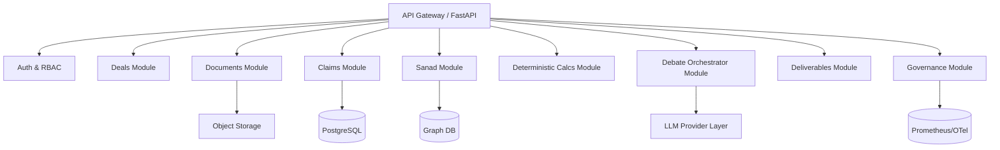

# IDIS Backend Structure and Service Architecture — v6.3

**Source**: IDIS VC Edition v6.3 (January 2026)  
**Purpose**: Provide a concrete backend structure (services/modules, APIs, jobs, data stores) to implement IDIS enterprise-grade.

This is written as a directive to the implementing AI coder. Where v6.3 is silent, this document provides recommended defaults.

---

## 1. Architectural Choice: Modular Monolith First, Service-Ready Boundaries

### 1.1 Recommendation

Start as a **modular monolith** with strict module boundaries:
- faster iteration,
- shared transaction boundaries for trust gates,
- easier audit log consistency.

Design modules so they can be split into microservices later (clean interfaces + event boundaries).

### 1.2 Boundary Rules (Hard)

- Anything that enforces trust (No-Free-Facts, Muḥāsabah, Sanad grading) MUST be deterministic code in the backend.
- LLM calls MUST be wrapped behind a provider abstraction with strict schema output validation.

---

## 2. Backend Module Map



---

## 3. Repository Layout (Recommended)

```text
backend/
  app/
    main.py
    settings.py
    api/
      routes_deals.py
      routes_documents.py
      routes_claims.py
      routes_sanad.py
      routes_calcs.py
      routes_debate.py
      routes_deliverables.py
      routes_governance.py
    domain/
      deals/
      documents/
      claims/
      sanad/
      defects/
      calculations/
      debate/
      deliverables/
      governance/
    services/
      ingestion_service.py
      parsing_service.py
      extraction_service.py
      sanad_service.py
      calc_runner.py
      debate_runner.py
      deliverables_generator.py
      enrichment_service.py
    validators/
      no_free_facts.py
      muhasabah.py
      matn_validators.py
      schema_validation.py
    persistence/
      db.py
      repositories/
      migrations/
    integrations/
      crm/
      doc_providers/
      enrichment_providers/
    observability/
      logging.py
      metrics.py
      tracing.py
    security/
      encryption.py
      key_management.py
      audit_log.py
  tests/
    unit/
    integration/
    e2e/
```

---

## 4. API Surface (Minimum Viable)

### 4.1 Deals

- `POST /deals` create deal
- `GET /deals/{deal_id}` retrieve
- `POST /deals/{deal_id}/ingest` start ingestion
- `GET /deals/{deal_id}/status` pipeline status
- `POST /deals/{deal_id}/approve` human gate approvals (role-protected)

### 4.2 Documents / Spans

- `GET /deals/{deal_id}/documents`
- `GET /documents/{document_id}/spans?type=...`
- `GET /spans/{span_id}` with locator and excerpt

### 4.3 Claims / Truth Dashboard

- `GET /deals/{deal_id}/claims`
- `GET /claims/{claim_id}` (includes Sanad, defects, evidence refs)
- `GET /deals/{deal_id}/truth-dashboard`

### 4.4 Sanad

- `GET /claims/{claim_id}/sanad`
- `POST /claims/{claim_id}/regrade` (admin/system only; logs config version)
- `POST /defects/{defect_id}/cure`
- `POST /defects/{defect_id}/waive` (requires waiver_reason)

### 4.5 Deterministic Calcs

- `POST /deals/{deal_id}/calculations/run`
- `GET /calculations/{calc_id}` (+ calc-sanad)

### 4.6 Debate

- `POST /deals/{deal_id}/debate/run`
- `GET /debate/{debate_run_id}`
- `GET /debate/{debate_run_id}/transcript`

### 4.7 Deliverables

- `POST /deals/{deal_id}/deliverables/generate`
- `GET /deliverables/{deliverable_id}`
- `GET /deliverables/{deliverable_id}/export?format=pdf|docx|pptx|xlsx`

### 4.8 Governance

- `GET /governance/metrics`
- `GET /governance/audit?deal_id=...`

---

## 5. Background Jobs / Workflow Engine

Use a job system (Celery/RQ/Temporal) for long-running tasks:

- ingestion pipeline:
  - parse documents
  - build spans
  - extract claims
  - build sanad graph
  - run deterministic calcs
  - execute debate
  - generate deliverables

### 5.1 Suggested Pipeline Event Types

- `deal.ingestion.started|completed|failed`
- `document.parsed|failed`
- `claims.extracted`
- `sanad.graded`
- `calc.executed`
- `debate.stopped`
- `deliverable.generated`

All events MUST include `tenant_id` and `deal_id` and be logged to an immutable audit log.

---

## 6. Deterministic Validators (Hard Requirements)

### 6.1 No-Free-Facts Validator

- Must run at:
  1) LLM tool wrapper output parser,
  2) Muḥāsabah validator gate,
  3) Deliverables generation (final check).

### 6.2 Muḥāsabah Validator

Reject output if:
- factual assertions exist but supported_claim_ids empty
- confidence > 0.80 and uncertainties empty
- confidence > 0.50 and falsifiability_tests empty (for recommendations)

### 6.3 Matn Validators (Truth Dashboard)

Implement as deterministic rules where possible:
- units/currency mismatch
- time-window mismatch (FY vs LTM vs quarter)
- ratio identity checks (GM, NRR, CAC payback)
- plausibility vs stage benchmarks (flag as “requires proof”, not “false”)

---

## 7. Audit Artifacts (Persistence Requirements)

Persist:
- all artifact versions + hashes
- all extraction results + model ids
- all sanads and defects
- debate transcript + stop reason + arbiter rationale
- MuḥāsabahRecords per output
- deterministic calc inputs/outputs/hashes
- approvals/overrides with actor + timestamp + reason

---

## 8. Security Controls (Backend-Enforced)

- RBAC at route level AND object level (tenant + deal)
- encryption key management (BYOK option)
- logging redaction for restricted content
- “Restricted” classification blocks export unless role permits

---

## 9. Testing Strategy (Backend)

Minimum required:
- unit tests for grade algorithm and validators
- integration tests for pipeline on sample deal pack
- e2e test that verifies:
  - no-free-facts is enforced
  - muhasabah required
  - deterministic calcs reproducible
  - grade D in material claim halts debate and escalates

