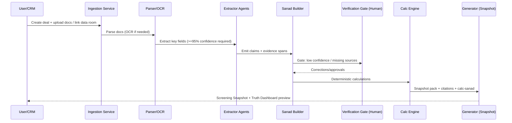

# IDIS VC Edition — Technical Design Document (TDD)
**Version:** v1.0 (derived from IDIS v6.3)  
**Date:** 2026-01-06  
**Status:** Draft (implementation-ready; open decisions marked **TBD**)  
**Owner:** Salim Al‑Barami  
**Audience:** Engineering, Security, Compliance, Product, Data/ML, DevOps/SRE

---

## 1. Purpose

This Technical Design Document (TDD) translates **IDIS v6.3 (VC Edition)** into an implementable, enterprise-grade system design.

IDIS (Institutional Deal Intelligence System) is an **AI Investment Analyst Layer** that sits between inbound VC deal flow and partner decision-making. It ingests heterogeneous deal materials, enriches them with external intelligence, performs deterministic financial calculations, runs structured multi-agent analysis and debate, and generates IC-ready outputs with **evidence governance** and **auditability**.

This TDD is optimized for building an end-to-end system with:
- **Zero numerical hallucination** via deterministic calculation engines.
- **Evidence-linked factual claims** via the Sanad Trust Framework.
- **Structured adversarial review** via a game-theoretic debate protocol.
- **Mandatory self-audit gates** via the Muḥāsabah protocol.
- **Enterprise security/compliance** (SOC 2 trajectory, privacy, tenant isolation, audit trails).

---

## 2. Goals and Non‑Goals

### 2.1 Primary Goals (Invariants)

1. **No‑Free‑Facts**  
   No factual statement in any user-facing deliverable may exist without:
   - `claim_id` (linked to a Sanad chain) **or**
   - `calc_id` (linked to Calc‑Sanad with reproducible inputs + formula hash).

2. **Deterministic Numerics**  
   All numerical outputs used for scoring, routing, dashboards, and deliverables are computed by deterministic engines (Python), not by LLMs.

3. **Sanad as a First‑Class Object**  
   Each claim must carry an explicit evidence chain (sanad) with grading, defects, and provenance.

4. **Muḥāsabah Hard Gate**  
   No agent output may propagate to the next layer unless it includes a valid Muḥāsabah record (self-accounting: evidence, uncertainty, falsifiability).

5. **Debate as Mechanism Design**  
   Multi-agent debate must incentivize error discovery and penalize unsupported assertions. Dissent must be preserved when stable and evidence-supported.

6. **Enterprise Auditability**  
   Every output must be reproducible, inspectable, and defensible:
   - source spans
   - calculation lineage
   - debate transcripts
   - muhasabah records
   - overrides

### 2.2 Secondary Goals

- Scale to **2,000–5,000 deals/year** per fund with configurable triage.
- Support **BYOL** data integrations (PitchBook/Crunchbase/etc.).
- Provide **interactive explainability artifacts** (Sanad Map, Muḥāsabah Log).
- Reduce analyst hours per deal by automation while preserving human gates.

### 2.3 Non‑Goals (Explicit)

- IDIS does **not** replace final IC decisions.
- IDIS does **not** perform definitive legal review of transaction documents.
- IDIS does **not** perform deep technical code audits or penetration testing.
- IDIS does **not** auto-send communications externally without human approval.

---

## 3. System Overview

### 3.1 High-Level Components (Aligned to IDIS Layers)

IDIS comprises the following functional layers:

1. **Ingestion & Deal Object Store**  
   Document intake, parsing, OCR, classification, versioning, and entity normalization.

2. **Sanad Graph Builder**  
   Construction of evidence-chain graph objects for all extracted claims.

3. **Knowledge Enrichment**  
   External data connectors and enrichment records with provenance.

4. **Deterministic Calculation Engines**  
   Reproducible Python calculators that consume verified inputs and emit Calc‑Sanad.

5. **Multi‑Agent Analysis + Debate (LangGraph)**  
   Specialized agents produce analyses; adversarial debate identifies flaws; arbiter resolves; dissent preserved.

6. **Deliverables Generator + Explainability Artifacts**  
   IC memo, screening snapshot, Truth Dashboard, and appendices (Sanad Map, Muḥāsabah Log, Debate Transcript).

7. **Feedback & Learning Loop**  
   Post-decision outcomes, corrections, drift monitoring (including Sanad coverage metrics).

---

## 4. Architecture

### 4.1 C4 Context Diagram (Conceptual)

```mermaid
flowchart LR
  Founder[Founder / Startup] -->|Deck, Data Room, Docs| IDIS[IDIS Platform]
  VC[VC Firm Users\nPartners / Analysts / IC] -->|Review, Verify, Approve| IDIS

  IDIS -->|IC Memos, Dashboards,\nQ&A Packs| VC
  IDIS -->|Info Requests| Founder

  subgraph External Data
    PB[PitchBook/Crunchbase/CB Insights]
    MR[Gartner/IDC/Forrester]
    MK[IMF/World Bank/Fed]
    ALT[SimilarWeb/LinkedIn/Glassdoor]
  end

  IDIS -->|BYOL Connectors| External Data
  IDIS -->|Sync| CRM[DealCloud/Affinity/Salesforce]
  IDIS -->|Docs| DMS[DocSend/Drive/SharePoint/Dropbox]
```

### 4.2 Deployment Topology (Recommended Default)

- **Kubernetes** (EKS/AKS/GKE) with per-tenant logical isolation.
- **Object storage** (S3/GCS/Azure Blob) for raw docs + extracted artifacts.
- **PostgreSQL** for transactional metadata + workflow state.
- **Vector DB** (pgvector or dedicated vector store) for semantic retrieval.
- **Graph DB** (Neo4j/ArangoDB/Neptune) for Sanad Graph + knowledge graph edges.
- **Message bus** (Kafka/SQS/PubSub) for async ingestion and pipeline orchestration.
- **Secrets vault** (AWS Secrets Manager / Hashicorp Vault).
- **Observability** (OpenTelemetry + Prometheus/Grafana + centralized logging).

> **TBD decisions:** exact cloud, graph DB, and vector DB choices.

---

## 5. Core Data Objects (Summary)

**Note:** A complete schema repo is specified in a dedicated document (to be produced next). This section is the minimal overview required for the TDD.

### 5.1 Claim

A typed assertion extracted or produced by the system.

Key fields:
- `claim_id` (UUID)
- `deal_id` (UUID)
- `claim_text` (human-readable)
- `claim_type` (enum: financial_metric, market_size, competition, traction, team, legal_terms, risk, etc.)
- `value` (optional typed payload)
- `units` (optional)
- `time_window` (optional)
- `materiality` (enum: immaterial, material, critical)
- `sanad_id` (FK)
- `status` (proposed, verified, contradicted, unknown, deprecated)

### 5.2 Sanad (Evidence Chain)

A first-class object linking `claim_id` to source(s) through a transmission chain.

Key fields:
- `sanad_id` (UUID)
- `primary_source` (doc span / cell / timestamp)
- `transmission_chain[]` (ordered nodes: extractor → calc engine → analysis agent → deliverable)
- `corroborating_sources[]` (independent sources)
- `sanad_grade` (A/B/C/D + optional A+)
- `defects[]` (typed defects + severity + cure protocol)
- `extraction_confidence` (0–1)
- `independence_evidence` (upstream_origin_id, system_of_record flags)

### 5.3 Defect

A typed weakness in a chain or content, inspired by ʿIlal.

Examples:
- `BROKEN_CHAIN` (Inqiṭāʿ)
- `CONCEALMENT` (Tadlīs)
- `INCONSISTENCY` (Iḍṭirāb)
- `ANOMALY_VS_STRONGER` (Shudhdh)
- `UNKNOWN_SOURCE` (Jahālah)
- `MISSING_LINK` (Irsāl)
- Enterprise extensions: `CIRCULARITY`, `STALENESS`, `UNIT_MISMATCH`, `IMPLAUSIBILITY`, etc.

### 5.4 Calc‑Sanad (Deterministic Calculation Provenance)

Key fields:
- `calc_id` (UUID)
- `formula_hash` (hash of code + version)
- `inputs[]` (each input references `claim_id` + its sanad grade)
- `output_value` + units/time-window
- `propagated_grade` (weakest-link min grade)
- reproducibility metadata (python env, package versions)

### 5.5 DebateState (LangGraph Orchestration State)

Key fields (normative):
- `deal_id`
- `round_number` (1–5)
- `messages[]`
- `claim_registry_ref`
- `sanad_graph_ref`
- `open_questions[]`
- `utility_scores{agent_id: score}`
- `arbiter_decisions[]`
- `consensus_reached` + `stop_reason`

---

## 6. End-to-End Pipelines

### 6.1 Pipeline A — Deal Intake → Screening Snapshot (Fast Path)

**Target:** 30–120 minutes compute + human gate SLA (dependent).



**Gating rules:**
- If extraction confidence < 0.95 for required fields → **pause** and request verification.
- Any Grade D claim → **cannot** appear; must be escalated.

### 6.2 Pipeline B — Deep Analysis → Debate → IC Deliverables (Full Path)

**Target:** <24 hours compute after completeness threshold met + verification SLAs.

```mermaid
flowchart TD
  A[Docs Ingested + Parsed] --> B[Structured Extraction + Claim Registry]
  B --> C[Sanad Graph Build + Grading]
  C --> D{Completeness >= threshold?}
  D -- no --> R[Request Missing Data from Founder]
  D -- yes --> E[Deterministic Calculations + Calc-Sanad]
  E --> F[Agent Analyses (Financial/Market/Team/Tech/Terms/Risk/Historian)]
  F --> G[LangGraph Debate Orchestrator]
  G --> H[Muḥāsabah Gate]
  H --> I[Deliverables Generator]
  I --> J[Explainability Artifacts\nSanad Map + Muḥāsabah Log + Debate Transcript]
  J --> K[Human Approval Gates\nAnalyst -> Partner -> IC]
  K --> L[Export + Sync]
```

---

## 7. Ingestion & Document Intelligence

### 7.1 Inputs Supported

- Pitch decks: PDF/PPT
- Financials: Excel (XLSX), CSV exports
- Data room docs: PDFs, docs, images
- Web sources: company site, GitHub links
- Optional: call recordings/transcripts, meeting notes

### 7.2 Parsing and Extraction

**Services:**
- `document_ingestion_service`
- `document_parser_service` (PDF, PPT, XLSX)
- `ocr_service` (fallback for scanned PDFs)
- `classification_service` (doc type, section tagging)
- `entity_resolution_service` (company, founders, products)

**Key requirements:**
- Store raw files immutable (WORM-like) with versioning.
- Create stable `doc_id` and `doc_version_id`.
- Every extracted datum must include a `SourceRef` (page/paragraph/cell or timestamp).
- If a datum cannot be mapped to the Common Data Model (CDM) with ≥0.95 confidence, it is flagged for human verification.

---

## 8. Sanad Trust Framework — Technical Implementation

### 8.1 Sanad Graph (Graph DB)

**Node types:**
- `Document`, `DocSpan`, `Claim`, `EvidenceItem`, `EnrichmentRecord`
- `Agent`, `HumanVerifier`, `CalcRun`, `DeliverableSection`

**Edge types:**
- `EXTRACTED_FROM` (Claim → DocSpan)
- `CORROBORATED_BY` (Claim → EvidenceItem/SourceRef)
- `PROCESSED_BY` (Claim → Agent)
- `CALCULATED_BY` (CalcRun → CalcEngine)
- `VERIFIED_BY` (Claim → HumanVerifier)
- `CONTRADICTS` (Claim → Claim)
- `DEPENDS_ON` (Claim → Claim) for derived claims

**Integrity constraints:**
- Reject any `Claim` that cannot connect to at least one primary `DocSpan` or validated `EnrichmentRecord`.
- Maintain version edges: Claim must point to the exact `doc_version_id` used.

### 8.2 Grading and Corroboration

**Grade rubric (default):**
- **A / A+**: primary machine-readable + strong corroboration (>=2 independent sources); A+ reserved for audited + regulatory filing.
- **B**: primary verified with partial corroboration OR high-credibility institutional source.
- **C**: single-source unverified, conflict-of-interest risk, or weak reliability.
- **D**: contradicted, fabricated, or fails integrity checks.

**Corroboration classes:**
- **Mutawātir**: >=3 independent sources; collusion implausible → can propagate with minimal gates.
- **Āḥād**: <3 sources → requires increased uncertainty + human gates depending on grade.

**Independence rules:**
- Independence requires different systems-of-record and no shared upstream preparer; track `upstream_origin_id`.

### 8.3 Defects and Cure Protocols

Every defect includes:
- `defect_type`
- `severity` (critical/high/medium/low)
- `description`
- `cure_protocol` (what evidence cures it)
- `introduced_by` (agent/system)
- `detected_by` (agent/system/human)
- `timestamp`

---

## 9. Deterministic Calculation Engines (Zero-Hallucination Zone)

### 9.1 Responsibilities

- Compute IRR/MOIC, runway, burn, LTV/CAC, payback, gross margin, cohort metrics, valuation multiples, scenario/sensitivity analyses.
- Perform reconciliation across documents (numbers match across deck/financials/exports).
- Emit `calc_id` + Calc‑Sanad metadata for reproducibility.

### 9.2 Hard Requirements

- Input values must be referenced by `claim_id` and have verified extraction (>=0.95) or explicit human approval.
- Output inherits minimum Sanad grade of inputs (“weakest-link”).
- A CalcRun must be reproducible from logs: inputs + code version + environment fingerprint.

### 9.3 Implementation Pattern

- Calculator registry:
  - `calc_name`
  - `calc_version`
  - input schema validation
  - deterministic function
  - output schema validation
  - formula hash generation

- Execution model:
  - stateless workers, idempotent runs
  - retries with strict immutability of inputs
  - store artifacts: CSV/JSON tables, plots, and serialized results

---

## 10. Multi‑Agent Analysis Engine

### 10.1 Agent Set (Default)

- Financial Agent
- Market Agent
- Technical Agent (architecture review; not deep audit)
- Terms Agent (economics; not legal)
- Team Agent
- Risk Officer Agent
- Historian Agent (institutional memory)
- Sector Specialist Agent (dynamic)

### 10.2 Structured Outputs

All agents must output:
- `supported_claim_ids[]`
- `supported_calc_ids[]`
- `analysis_sections{}` keyed to deliverable templates
- `risks[]` with evidence links
- `questions_for_founder[]`
- `confidence` + justification
- `MuḥāsabahRecord` (required)

### 10.3 Tooling Policy

- Agents may not “free-type” facts. They must:
  - retrieve from claim registry, or
  - request extraction, or
  - call deterministic calculators, or
  - cite enrichment records.

**No‑Free‑Facts is enforced at:**
1. Tool wrapper/output parser (reject unsupported factual spans)
2. Muḥāsabah validator (reject missing support)

---

## 11. Debate Layer — LangGraph Orchestration

### 11.1 Why LangGraph

LangGraph provides a formal state machine for:
- debate rounds,
- stop conditions,
- memory persistence,
- and deterministic enforcement hooks.

### 11.2 Debate Roles (Mechanism Players)

- **Advocate**: argues “best case” for a recommendation (e.g., invest).
- **Challenger**: attacks reasoning/evidence gaps.
- **Sanad Breaker**: targets weak chains, missing links, concealment.
- **Contradiction Finder**: searches cross-document inconsistencies.
- **Risk Officer**: focuses on downside, fraud, regulatory risk.
- **Arbiter**: validates challenges, assigns utility, final summary, preserves dissent.

### 11.3 DebateState (Normative Schema)

```json
{
  "deal_id": "UUID",
  "claim_registry_ref": "ClaimRegistryRef",
  "sanad_graph_ref": "GraphRef",
  "open_questions": ["string"],
  "round_number": 1,
  "messages": [{"role": "string", "content": "string", "claim_refs": ["UUID"], "timestamp": "iso"}],
  "utility_scores": {"agent_id": 0},
  "arbiter_decisions": [{"round": 1, "decision": "string", "rationale": "string"}],
  "consensus_reached": false,
  "stop_reason": "CONSENSUS|STABLE_DISSENT|EVIDENCE_EXHAUSTED|MAX_ROUNDS|CRITICAL_DEFECT|null"
}
```

### 11.4 Stop Conditions (Explicit)

- **CONSENSUS**: all agent confidences converge within ±10% band.
- **STABLE_DISSENT**: positions unchanged for 2 consecutive rounds → preserve dissent.
- **EVIDENCE_EXHAUSTED**: no new evidence available to adjudicate.
- **MAX_ROUNDS**: reached 5 rounds → escalate unresolved issues to human.
- **CRITICAL_DEFECT**: Grade D or critical defect on material claim → mandatory human review.

### 11.5 Utility Scoring (Safe Design)

Utility must be incentive-aligned and non-gameable:
- **Materiality gate**: scoring only for material items (affects recommendation, score band, red flags).
- **Proper scoring rule**: use Brier score on verifiable probabilistic forecasts.
- **Verification requirement**: Arbiter confirms challenge validity; humans confirm for ex-post scoring.
- **Time-windowed penalties**: higher penalty if contradicted within same run.

### 11.6 Dissent Preservation Policy

Dissent is preserved if:
- supported by >= Grade C evidence,
- authored by agent with positive cumulative utility,
- not ruled frivolous by Arbiter.

---

## 12. Muḥāsabah Protocol — Mandatory Self‑Audit Gate

### 12.1 MuḥāsabahRecord (Required Fields)

- `claim_summary`
- `supported_claim_ids[]` / `supported_calc_ids[]`
- `strongest_evidence_summary`
- `counter_hypothesis`
- `uncertainties[]` (mandatory when grade < A or corroboration is Āḥād)
- `falsifiability_tests[]` (mandatory for recommendation-affecting claims)
- `failure_modes[]`
- `confidence` (0–1) + justification

### 12.2 Validator Rules (Normative)

Reject output if any is true:
- Facts present but `supported_claim_ids` empty.
- `confidence > 0.80` AND (min_grade < B OR corroboration = Āḥād) AND `uncertainties` empty.
- Recommendation present AND `falsifiability_tests` empty.

MuḥāsabahRecords are stored as immutable audit artifacts linked to:
`deal_id`, `agent_id`, `round_number`, and referenced claim/calc IDs.

---

## 13. Deliverables and Explainability

### 13.1 Deliverables (VC Edition)

- Screening Snapshot
- Truth Dashboard (verified/contradicted/unverified/ambiguous claims)
- Investment Memo (IC-ready)
- Stage Packs (Seed, Series A, Series B, Growth)
- Auto-generated Q&A for founder calls
- Decline letter drafts (internal only; human approval required)

### 13.2 Explainability Artifacts (Always Generated)

1. **Sanad Map**  
   Graph visualization of claim nodes and evidence chains; grade coloring; defect annotations; click-through.

2. **Muḥāsabah Log**  
   Per-agent self-audit records; falsifiability; uncertainty; overrides.

3. **Debate Transcript**  
   Full round transcript with claim references and Arbiter decisions; utility scores.

---

## 14. Security, Privacy, and Compliance

### 14.1 Data Protection

- Encryption at rest (AES‑256) and in transit (TLS 1.3).
- BYOK supported (tenant-managed keys).
- No training on customer data (explicit contractual + technical enforcement).

### 14.2 Identity and Access

- SSO (Okta/Azure AD), MFA required.
- RBAC with least privilege:
  - Analyst, Partner, IC, Admin, Auditor.
- Ethical walls supported for IB/PE use cases (matter-level segregation).

### 14.3 Audit and Retention

- Immutable audit log for:
  - ingestion events
  - claim creation/modification
  - grading changes
  - human approvals/overrides
  - deliverable exports
- Configurable retention + legal hold.

### 14.4 Compliance Roadmap

- SOC 2 Type II: target per business plan (requires formal controls + evidence).
- ISO 27001: planned.
- GDPR/DPA: supported.
- EU AI Act: treat as high-risk-like system (explainability + governance).

---

## 15. Observability and QA

### 15.1 Core Operational Metrics

- Pipeline latency (ingestion → snapshot; ingestion → memo)
- Queue depth/backlog
- LLM token usage and cost per deal (bounded)

### 15.2 Quality Metrics (From v6.x)

- Sanad coverage rate (target ≥95% for claims)
- Grade distribution drift (alert on >10% wk/wk shift toward C/D)
- Defect rate trend by type
- Corroboration ratio (avg independent sources per claim; target ≥1.5)
- Muḥāsabah pass rate (target ≥98%)
- Debate consensus rate (target ≥75%)
- Round efficiency (avg rounds; target <3.5)

### 15.3 Testing Strategy

- Unit tests for parsers and calculators.
- Golden dataset regression tests (sample deals with expected outputs).
- Property-based tests for reconciliation and unit checks.
- Adversarial tests: fabricated decks, inconsistent spreadsheets, missing docs.
- Security tests: SAST/DAST, secrets scanning, dependency audits.

---

## 16. Failure Modes and Safeguards

### 16.1 Key Failure Modes

- Bad extraction → wrong calc output.
- Founder bias / unsupported narrative → hallucinated “facts.”
- Agent groupthink → missed defects.
- Enrichment inconsistencies → incorrect market reality.

### 16.2 Safeguards

- Confidence gating before calculations.
- No‑Free‑Facts enforcement.
- Sanad grading + defect taxonomy.
- Debate with adversarial roles and utility scoring.
- Muḥāsabah hard gate and “humility metrics.”
- Human approval gates before IC dissemination.

---

## 17. Interfaces and Integrations

### 17.1 Integration Surfaces

- CRM (DealCloud/Affinity/Salesforce): create/update deals, sync status, attach outputs.
- Document sources (DocSend/Drive/SharePoint/Dropbox): ingest content.
- Data providers (BYOL): enrichment records with provenance.

### 17.2 API (Minimal Contract)

- `POST /deals` create deal
- `POST /deals/{id}/documents` upload/link docs
- `POST /deals/{id}/run?mode=snapshot|full`
- `GET /deals/{id}/claims`
- `GET /deals/{id}/sanad/{sanad_id}`
- `GET /deals/{id}/deliverables/{type}`
- `POST /deals/{id}/human-verification` submit corrections/approvals
- `POST /deals/{id}/override` partner overrides with justification

---

## 18. Open Decisions (**TBD**) and Assumptions

### 18.1 TBD Decisions

- Graph DB choice (Neo4j vs Neptune vs ArangoDB) based on query patterns + cost.
- Vector DB choice (pgvector vs dedicated store).
- Event bus choice (Kafka vs managed queues).
- Multi-tenant isolation strategy (namespace isolation vs separate clusters; KMS per tenant).

### 18.2 Assumptions

- Deal data room completeness can reach ≥70% for “IC-ready in 5–7 days” targets.
- Human verification gates meet operational SLAs (client-dependent).
- BYOL licenses are handled contractually; IDIS does not redistribute unlicensed data.

---

## 19. Implementation Checklist (Engineering Tasks)

This TDD implies the following implementation workstreams:

1. **Ingestion + Parsing**
   - Doc upload/linking
   - OCR + extraction
   - doc versioning + provenance

2. **Claim Registry + CDM**
   - typed schemas
   - confidence scoring
   - human verification UI/API

3. **Sanad Graph**
   - graph schema + constraints
   - grading + corroboration logic
   - defect detection + cure workflows

4. **Deterministic Calc Service**
   - calculator registry
   - Calc‑Sanad generation
   - reconciliation tests

5. **LangGraph Orchestrator**
   - DebateState, nodes, edges
   - stop conditions
   - role prompts + tools + policy enforcement

6. **Muḥāsabah Gate**
   - schema + validator
   - storage + audit sampling

7. **Deliverables**
   - templates + generator
   - Sanad Map artifact
   - Muḥāsabah Log + Debate Transcript

8. **Security/Compliance**
   - RBAC/SSO/MFA
   - encryption/BYOK
   - audit logging
   - retention/legal hold

9. **Observability + QA**
   - metrics dashboards
   - drift monitoring
   - regression tests (golden deals)

---

## Appendix: Alignment to IDIS v6.3 Document

This TDD operationalizes the following v6.3 sections:
- Part II: Truth Dashboard
- Part II‑A: Sanad Trust Framework
- Part V: Platform Architecture (Layers 1–6)
- Part VI: Explainability & Decision Transparency
- Appendix C/C‑1: Debate Protocol + LangGraph specification
- Appendix E: Muḥāsabah Protocol
- Appendix F: Game-theoretic mechanism design notes

---
